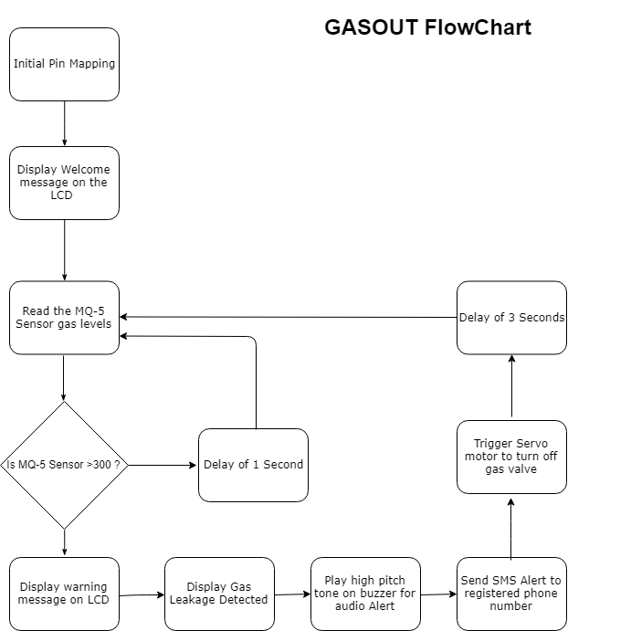

## Team Members:
- Albert Omware - Scrum Master, Intergration of GSM module
- Ivy Mwende - Intergration of the gas sensor
- David Watibini - Intergration of the servo motor
- Joseck Ogachi - Intergration of the lcd display module

## About the Project:

Gas leakages resulting in fatal inferno has become a serious problem in the household and other areas where household gas is handled and used. Gas leakage leads to various accidents resulting in financial loss as well as human injuries and/or loss.

The work aims at designing a system that detects gas leakage and alerts the subscriber through alarm and status display beside turning off the gas supply valve as a primary safety measure. An additional functionality of a GSM enabled SMS Alert system is also made.

## Circuit Diagram:

## Components Required:

1.	Arduino UNO
2.	16x2 LCD
3.	Relay
4.	MQ-5 Gas Sensor
5.	Servo Motor
6.	SIM 800 GSM Module
7.	Piezo Buzzer
8.	12V,2A Power Adapter

## Flowchart:

## Known Bugs
There are no known bugs for this project at the moment.
## Technologies Used
* C Programming Language
* Arduino IDE

### License
*This project is licensed under the MIT License - see the LICENSE.md file for details*
Copyright (c) {2019} **{GASOUT TEAM}**

